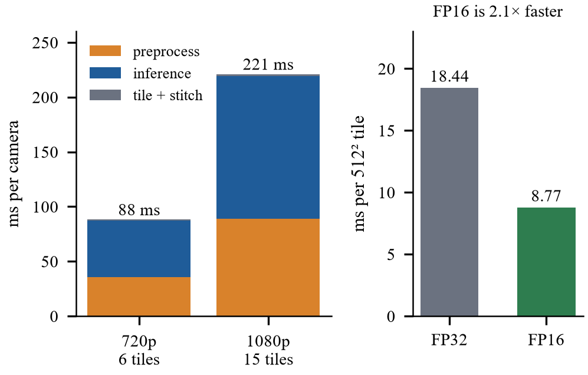
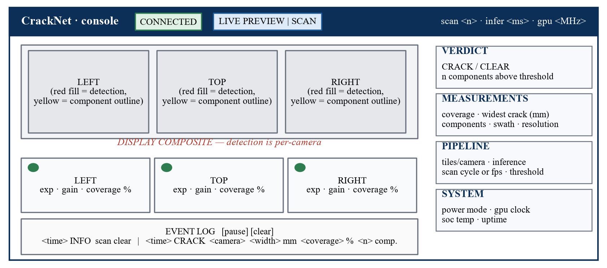

# 06 — Deployment, the console, and the network

*Paper: §III-F (deployment), §III-J (console and networked operation), §IV-C
(edge deployment); Figs. 1, 11, 15; Tables V, XII.*

Code: `build_engines.sh`, `trt_infer.py`, `serve_scan.py`, `viewer/dashboard.html`,
`cracknet.sh`, `cracknet.bat`, `netlink.sh`, `tools/jssh.py`, `tools/jlink.py`,
`tools/jproxy.py`.

---

## 1. From weights to an engine

```
best.pt (PyTorch, 26 MB)
   │ export
   ▼
cracknet.onnx + cracknet.onnx.data   (opset 18, input [1,3,512,512])
   │ trtexec --fp16          ← run ON the Jetson
   ▼
cracknet_fp16.engine          cracknet_fp32.engine (reference)
```

- **ONNX** is a portable graph description; **TensorRT** compiles it for *this*
  GPU. The engine is bound to one board and one TensorRT version — it must be
  rebuilt (`bash build_engines.sh`), never copied.
- TensorRT 10.3 parses opset 18 directly; the opset-17 re-export in the original
  guide was **not needed**.
- Engines are git-ignored (`*.engine`).

### Running one inference (`trt_infer.CrackNetTRT`)

```
host (page-locked buffer) ──memcpy_htod_async──▶ device input
                                   execute_async_v3 on a CUDA stream
host ◀──memcpy_dtoh_async── device output (logits)   →  stream.synchronize()
```

Page-locked ("pinned") host memory lets the copies be asynchronous. One bug
worth knowing: `pycuda.autoinit` creates the CUDA context on the **main** thread
and a context belongs to one thread at a time, so the scan thread must `push()`
it — otherwise every call raises *"invalid device context"*.

---

## 2. Latency — Fig. 15, Table V



### What the two panels show

**Left**: stacked per-camera pipeline time for a 720p frame (6 tiles) and a 1080p
frame (15 tiles). **Right**: the engine alone, FP32 vs FP16, per 512² tile.

### Where the numbers come from (all MEASURED on the device)

| Quantity | Value | Tool |
|---|---|---|
| FP16 engine, one tile | 8.77 ms (113.7 qps) | `trtexec` GPU compute |
| FP32 engine, one tile | 18.44 ms | `trtexec` |
| 720p, 6 tiles | 35.4 pre + 52.1 inf + 0.6 tile = **88.2 ms** | `bench_tiling.py` |
| 1080p, 15 tiles | 89.0 pre + 130.3 inf + 1.7 tile = **221.1 ms** | `bench_tiling.py` |
| Live, 1 tile | ≈ 15 ms; 10 fps for three cameras | live mode |

### A lesson: why `trtexec`'s number is not the system's number

The first estimate multiplied 8.77 ms by 15 tiles = 131.6 ms and called it done.
Measured: **221 ms**. The estimate ignored preprocessing (CPU NumPy), host↔device
copies, and (then) the sigmoid. The estimate was 1.7× optimistic — the *method*
was wrong even though the conclusion (well under a second) survived.

### The clock trap

`jetson_clocks` locks the GPU at 1020 MHz but **does not survive a reboot**. An
unlocked GPU idles at 306 MHz — a factor of 2.6. The first run of the tiling
benchmark reported 2.04 s per scan position because of this; with clocks locked
it is 0.66 s. **Every timing in the paper was taken with the clock state
checked**, and `bench_tiling.py` now prints a warning rather than a silently bad
number. `cracknet check` reports the GPU clock for the same reason.

### Parity — is the fast engine still right?

| Test | Result |
|---|---|
| TensorRT FP16 vs ONNX Runtime, real webcam frames | **0.0552 %** of mask pixels differ (bar 0.1 %) |
| Non-vacuous? | 38 % of pixels cleared the threshold — so "0 disagreement" could not be an all-background artefact |
| Logit-space threshold vs probability threshold | 0 of 3,932,160 pixels differ |

Why webcam frames: the CRACK500 validation images were never on the device
(`crack500_val.json` held only Colab Drive paths), so `capture_samples.py` grabbed
C920 frames and `check_parity.py` was rewritten to report the above-threshold
fraction so a vacuous pass would be visible.

---

## 3. The console



*Paper Fig. 11. SCHEMATIC. Values are placeholders by design.*

### Architecture

```
 ScanLoop thread ──publish──▶ { jpegs, status, events }   ← shared state, under a lock
       ▲                                  │
 captures + infers                        │ read-only
                                          ▼
              HTTP handlers (one thread per viewer)
```

- **One producer, many readers.** The scan loop publishes finished JPEGs and a
  status dict; handlers only read. No number of viewers can slow a scan, and a
  scan is never half-published.
- Sequence numbers + a `Condition` let streaming handlers wait for "a frame
  newer than the one I sent" (timeout 20 s, because a scan takes ~6 s).

### Endpoints (`serve_scan.py`)

| Endpoint | Returns |
|---|---|
| `/` | `viewer/dashboard.html` (plain HTML + JS, no build step) |
| `/stream.mjpg` | the composite as `multipart/x-mixed-replace` MJPEG |
| `/cam/<i>/snapshot.jpg` | one camera's overlaid frame |
| `/status.json` | everything in the panels |
| `/events.json?since=<id>` | log entries newer than `<id>` |

### What the numbers in `status.json` are

| Field | Meaning | Note |
|---|---|---|
| `crack` | any camera's coverage > `alert_frac` (1 %) | an *alarm*, not a measurement |
| `coverage` | mean of per-camera coverage | **averaged, not pooled** — three cameras see different ground, so pooling would let one busy camera be diluted depending on frame size |
| `widest_mm` | max over cameras of the widest component (p95 ridge) | only as good as the standoff |
| `swath_m` | `3 × GSD × width / 1000` | 1.69 m at 0.40 m |
| `gsd_mm_px` | mm per pixel | the scale factor on every width |
| `infer_ms` | inference time per camera | |
| `cycle_s`, `capture_s` | whole scan, capture part | ≈ 6.6, 5.9 |
| `power_mode`, `gpu_mhz`, `temp_c` | system | should read `MAXN_SUPER`, `1020` |
| `cameras[i]` | exposure, gain, luma, converged, coverage, … | healthy = `exp 156, gain 0` |

### The "demo · synthetic" badge

`tools/demo_server.py` serves **the same endpoints** with synthetic data; it was
built first so the page could be developed with no hardware. The only difference
the page can observe is `status.source` — `"synthetic"` vs `"jetson"` — and it
shows an amber badge for the former. A demo that looks like real inference but
is not is a trap: someone asks "is that live?" and the honest answer must be
instant.

### Logging rule

Log **on change, plus a heartbeat every 4th scan** (~27 s). Logging every scan
would bury the one line that matters; logging only on change leaves the panel
silent through a long clear run — indistinguishable from a crashed loop.

---

## 4. Scan mode vs live mode — Table XII

| | scan | live preview |
|---|---|---|
| Cameras | one at a time, 1080p | all three, 640×480, held open |
| Rate | ≈ 6.6 s per position | 10 fps (measured) |
| Detection | 15 native tiles | centre-crop → 512, 1 tile |
| Inference | 223 ms/camera | 15 ms/camera |
| mm/px at 0.4 m | 0.29 | 0.83 |
| Smallest crack | ≈ 0.59 mm | ≈ 1.65 mm |
| Use for | **measurement** | **aiming and monitoring** |

They publish the same field names with *different meanings*. Because a reader
must never guess which they are reading, the mode appears in four places (header
pill, stage caption, status payload, and the cycle-row label).

Live mode's `min_area` rescales too: 600 px at native 1080p becomes **76 px** in
live preview, because those pixels are ~2.8× coarser.

---

## 5. Network — why the Jetson hosts its own access point

The goal: start something once, unplug USB, keep driving the Jetson from the PC.

### What was tried and measured

| Path | Result | Evidence |
|---|---|---|
| **Campus Wi-Fi (IOT-PROJ)** | Both machines join and reach the internet — and **cannot reach each other** | PC → gateway 0 % loss, 1 ms; PC → Jetson 100 % loss, TCP 22 refused |
| **Wired jack** | Link up (`carrier=1`), DHCP times out twice (45 s each) | PC on the same network gets a lease; the port serves only **registered MACs** |
| **USB gadget link** | Works (192.168.55.1) — but needs the cable | |

The Wi-Fi result is **client isolation**: an access-point setting that blocks
station-to-station traffic. Gateway answers, other client never does. Nothing on
either machine can change it, and a listener on the PC would not help (this
account has no admin rights and inbound is firewalled).

### The solution

```
 Jetson (wlP1p1s0)  ── hosts AP "CrackNet", 10.42.0.1/24 ──▶  PC joins it
        │                                                       │
        └── dnsmasq (NetworkManager "shared")  ──── DHCP ───────┘
```

As the AP the Jetson **owns the subnet**: nothing can isolate anything and no
DHCP server must approve it. The PC keeps its internet on its wired adapter.

| Property | Value |
|---|---|
| SSID / address | `CrackNet` / `10.42.0.1` |
| Security | WPA2-PSK, **random password generated on the board**, never stored in the repo |
| Band | 2.4 GHz default |
| Power-save | **off** — on the radio it appears as multi-hundred-ms stalls in an MJPEG stream, which reads as "the camera is laggy" |

### The cost

The `rtl88x2ce` radio does **AP or client, never both** (it advertises no valid
interface combinations). **In AP mode the Jetson has no internet.** `netlink.sh
wifi` / `cracknet netmode wifi` switches back for `apt`.

### Routes are probed, not configured

`JETSON_HOSTS=10.42.0.1,192.168.55.1` in the (git-ignored) `tools/.jetson.env`.
`jssh.connect()` does a 1.5 s TCP probe of each and uses the first that answers,
so plugging USB in or out needs no edit. A dead candidate costs 1.5 s instead of
SSH's 20 s timeout.

### The bug the reboot test caught

"It comes back by itself" was only worth claiming once the board had been
rebooted:

| Side | Result |
|---|---|
| Jetson | AP back at `10.42.0.1`, `autoconnect yes` priority 20 |
| **Windows** | **Stayed disconnected for > 2 min** despite "Connect automatically"; an explicit `netsh wlan connect` worked instantly |

Windows does not promptly retry an SSID that vanished mid-connection. Since that
is precisely the moment USB is unplugged, `jlink.py` reconnects by itself when no
route answers.

### Internet for `apt`/`pip` without leaving AP mode

`tools/jproxy.py` asks sshd for a *remote port forward* (Jetson
`127.0.0.1:3128`) and acts as an HTTP/HTTPS(CONNECT) proxy for whatever arrives
down the SSH session. It needs no admin rights, no Internet Connection Sharing,
and no firewall rule (the SSH session is outbound from Windows). **Status: the
proxy core is tested (HTTP and HTTPS both 204); the SSH forward half is
untested** — the board was unreachable when it was written.

---

## 6. Operating it — `cracknet.bat`

From PowerShell in the project root:

| Command | Does |
|---|---|
| `.\cracknet.bat check` | Preflight: TensorRT, cv2, pycuda, engine, camera count, `rig.json`, GPU clock, power mode — **exits non-zero if anything is wrong** |
| `.\cracknet.bat live` / `scan` | Restart the server in that mode (restart, not start: a refusal over a stale process is the last thing to debug mid-demo) |
| `.\cracknet.bat status` / `logs` / `stop` | Inspect / tail / stop |
| `.\cracknet.bat link` / `join` | Show routes / join the AP (one time per PC) |
| `.\cracknet.bat net "cmd"` | Run a command on the Jetson with the PC's internet |

Preflight counts cameras through `/dev/v4l/by-path/*-video-index0`, not
`/dev/video*` (the `videoN` numbers shuffle and each C920 exposes a second
metadata node that would double the count).

> **Security note.** The console is unauthenticated and binds `0.0.0.0`: anyone
> who can reach the Jetson can watch. Acceptable on the private `CrackNet` AP,
> not on an open network.

---

## 7. Silent failures specific to deployment

| Symptom | Cause |
|---|---|
| Everything 2.6× slower, no error | `jetson_clocks` lost on reboot |
| Power drops 25 → 15 W after "maximum" | On this board `nvpmodel -m 0` is **15 W**; MAXN_SUPER is mode **2** |
| `apt` fails: *Release file not valid yet* | RTC days behind; NTP (UDP 123) blocked on the campus network → set clock from an HTTP `Date` header |
| `ping` fails but internet works | ICMP filtered on the campus network — test with HTTP |
| Server dies at startup: "invalid device context" | CUDA context not pushed onto the worker thread |
| `ThreadingHTTPServer` MRO error | `ThreadingHTTPServer` already includes the mixin |
