# 07 — Every figure and every table

For each of the paper's **21 figures** and **12 tables**: what it shows, exactly
where its data came from, how it was produced, how to read it, and what not to
conclude from it.

Provenance tags: **DATA** (a file in the repo), **CODE** (the shipped modules were
run), **MEASURED** (taken on the Jetson, recorded in a doc), **DERIVED**
(formula), **SCHEMATIC** (drawing). All figures regenerate with
`docs/documentation/figures/make_figures.py` ([10](10-reproduce-and-extend.md)).

| Fig. | Title | Provenance | Section |
|---|---|---|---|
| 1 | System architecture | SCHEMATIC | III-A |
| 2–4 | Hardware photographs | **placeholders** | III-B |
| 5 | Rig geometry | SCHEMATIC | III-C |
| 6 | USB bandwidth | DERIVED | III-D |
| 7 | Exposure ladder | MEASURED (modelled curve) | III-E |
| 8 | Tile plan | CODE | III-G |
| 9 | Blend window + artefact | CODE | III-G |
| 10 | Pipeline with costs | SCHEMATIC + MEASURED | III-H |
| 11 | Console layout | SCHEMATIC | III-J |
| 12 | Training curves | DATA | IV-A |
| 13 | Threshold sweep | DATA | IV-A |
| 14 | METU false positives | DATA | IV-B |
| 15 | Latency | MEASURED | IV-C |
| 16 | Capture timeline | MEASURED | IV-D |
| 17 | False-positive reduction | MEASURED | IV-E/F |
| 18 | Valley vs step | CODE | IV-F |
| 19 | Straightness | CODE | IV-F |
| 20 | Width estimators | CODE | IV-G |
| 21 | Resolution vs standoff | DERIVED | IV-H |

---

# Figures

## Fig. 1 — System architecture

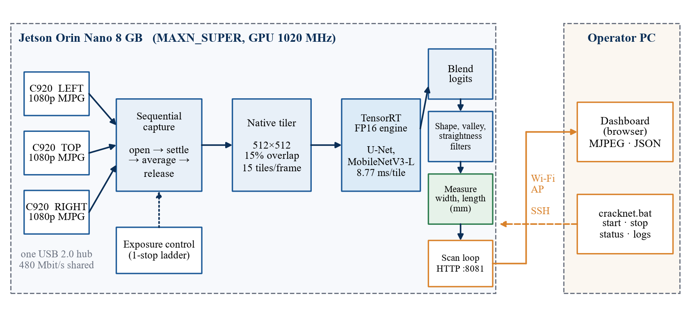

- **Shows.** Everything on the Jetson (left panel: three cameras → sequential
  capture → tiler → TensorRT engine → blend → filters → measurement → scan
  loop/HTTP) and the operator PC (right panel: dashboard, launcher), joined by the
  Jetson-hosted Wi-Fi AP (orange) and SSH (dashed).
- **Source.** Drawn by `fig_arch()` — SCHEMATIC, no data. The only numbers on it
  (`8.77 ms/tile`, `15 tiles/frame`, `480 Mbit/s`, `GPU 1020 MHz`) are from
  Tables II and V.
- **Read.** Solid blue arrows are data flow; the dotted arrow is the exposure
  controller acting on capture; orange is the network.
- **Do not conclude.** That the diagram is a deployment photograph: it is not.

## Figs. 2–4 — Hardware photographs (placeholders)

Three shaded boxes in the Word file reserve space for photographs:

| Fig. | Should show |
|---|---|
| 2 | The assembled rig: three C920 on the carriage (left, top, right) |
| 3 | The Jetson Orin Nano with the shared USB 2.0 hub, power and cabling |
| 4 | Close-up of the camera mounts and the test target at the working standoff |

These are the **only** placeholders in the paper; everything else is produced.

## Fig. 5 — Rig geometry

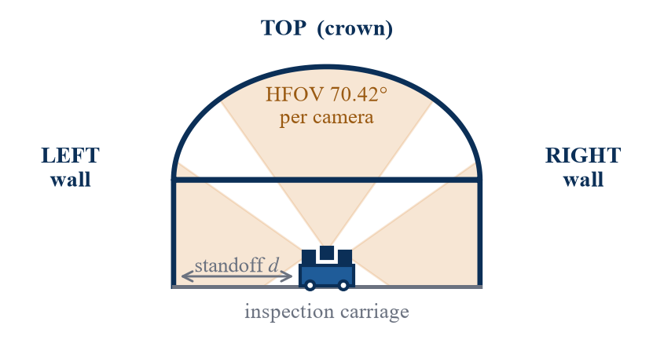

- **Shows.** A tunnel cross-section with three cameras and their 70.42° fields of
  view covering left wall, crown, right wall. "Standoff d" is the camera-to-lining
  distance.
- **Source.** `fig_geometry()`. The cones are **ray-cast against the lining
  section** so they stop at the wall, crown and floor instead of leaking through.
  Dimensions (9.2 m wide, arch rise 3.4 m) are illustrative.
- **Do not conclude.** That this was tested in a tunnel. It is the *intended*
  deployment; the caption says "schematic; not a measured scene".

## Fig. 6 — Why the pixel format matters on a shared USB 2.0 bus

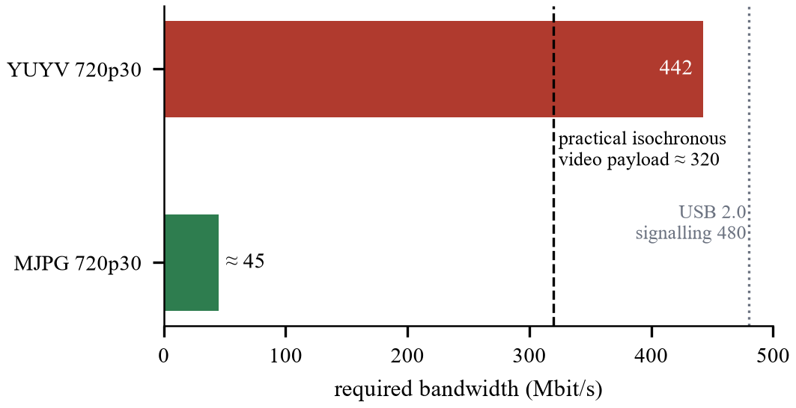

- **Shows.** Required bandwidth of YUYV vs MJPG at 720p30 against the practical
  isochronous payload (~320) and USB 2.0 signalling (480).
- **Source.** DERIVED: `1280 × 720 × 16 × 30 = 442.4 Mbit/s`; MJPG ≈ 45 from
  `perception.html` §1; 320 is a rule of thumb.
- **Read.** YUYV overshoots the practical ceiling → the camera quietly negotiates
  down to ~10 fps.
- **Caveat.** This is about *data rate*. The failure that actually stopped the
  third camera was *bandwidth reservation* (Table VI), which this bar chart does
  not show.

## Fig. 7 — Exposure applied vs exposure requested

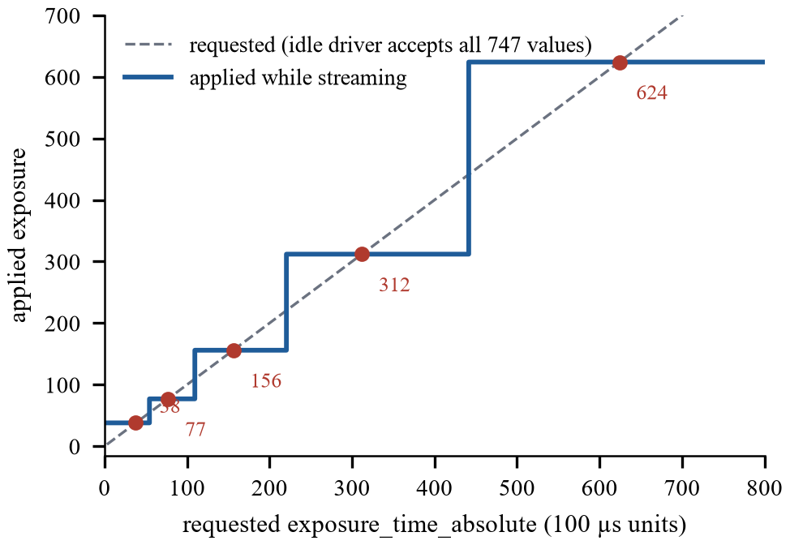

- **Shows.** A staircase: whatever exposure you ask for while streaming, you get
  one of 38, 77, 156, 312, 624.
- **Source.** MEASURED rungs (writing 5…899 with a stream open and reading back);
  the *staircase* is drawn by snapping each request to the nearest rung in log
  space — `camera_ctl.rung_index`. It is a model of the measured behaviour.
- **Read.** Each rung is double the last (one stop). Flat segments are the
  "dead zone" where changing the request changes nothing.
- **Caveat.** Only 38…624 were observed. The code's `EXP_RUNGS` also lists 19,
  1250, 2047 by extrapolation.

## Fig. 8 — Tile plan for a 1920×1080 frame

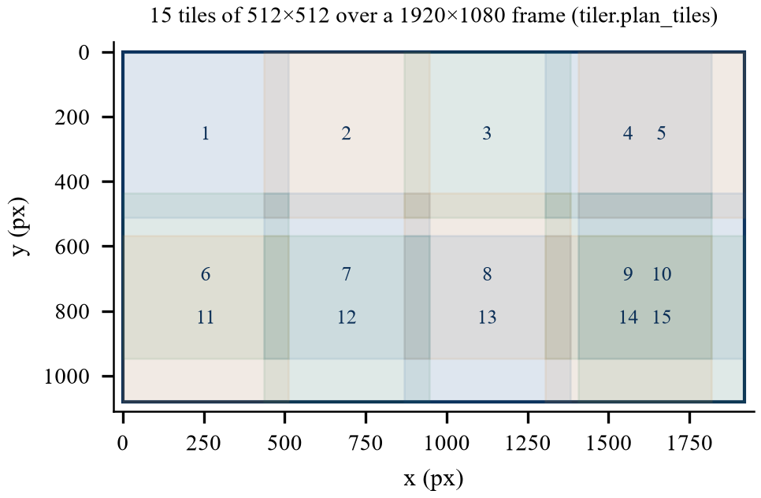

- **Shows.** The 15 tiles the deployed tiler places over the frame; shading
  darkens where tiles overlap.
- **Source.** CODE: `tiler.plan_tiles(1920, 1080)`. Origins: x = 0, 435, 870,
  1305, 1408; y = 0, 435, 568.
- **Read.** Notice tiles 4/5 and the lower rows overlap far more than the nominal
  15 % — the last column/row is *clamped* to the frame edge.
- **Why.** Clamping instead of zero-padding avoids a hard black edge that the
  detector would fire on.

## Fig. 9 — Tile window and a border artefact

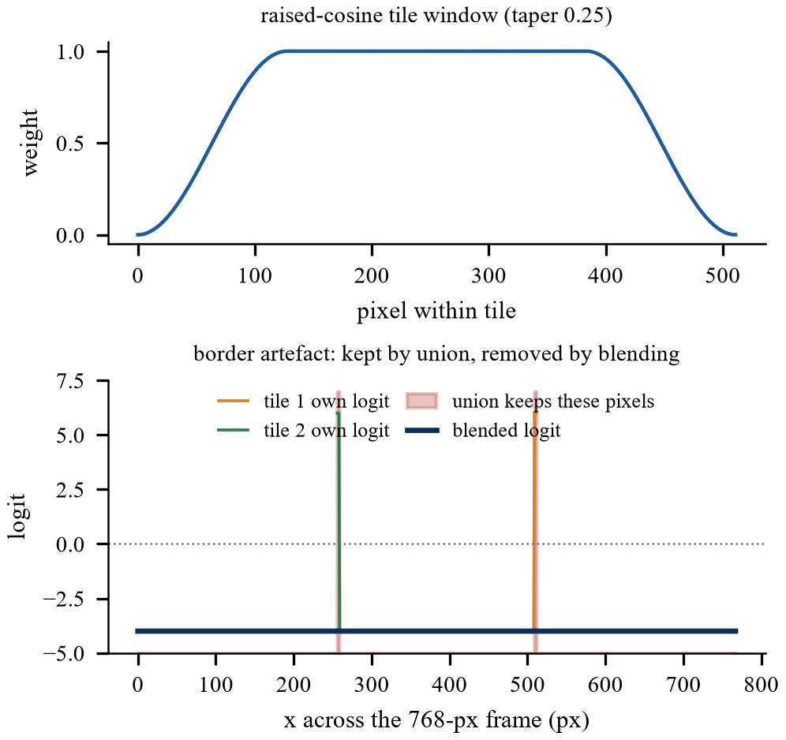

- **Shows.** Top: the raised-cosine weight across one tile. Bottom: a synthetic
  two-tile demonstration — each tile's own border spike (orange, green) is kept
  by a union (red) but averaged away by blending (blue).
- **Source.** CODE: `tiler.tile_window` and `tiler.blend_logits` on a synthetic
  768×512 frame; union count printed by the script (3,072 pixels) vs 0 after
  blending.
- **Do not conclude.** That this is a measurement on real frames — it
  illustrates the mechanism. Real-frame effect: Fig. 17(a) and §IV-E.

## Fig. 10 — Pipeline with measured per-stage cost

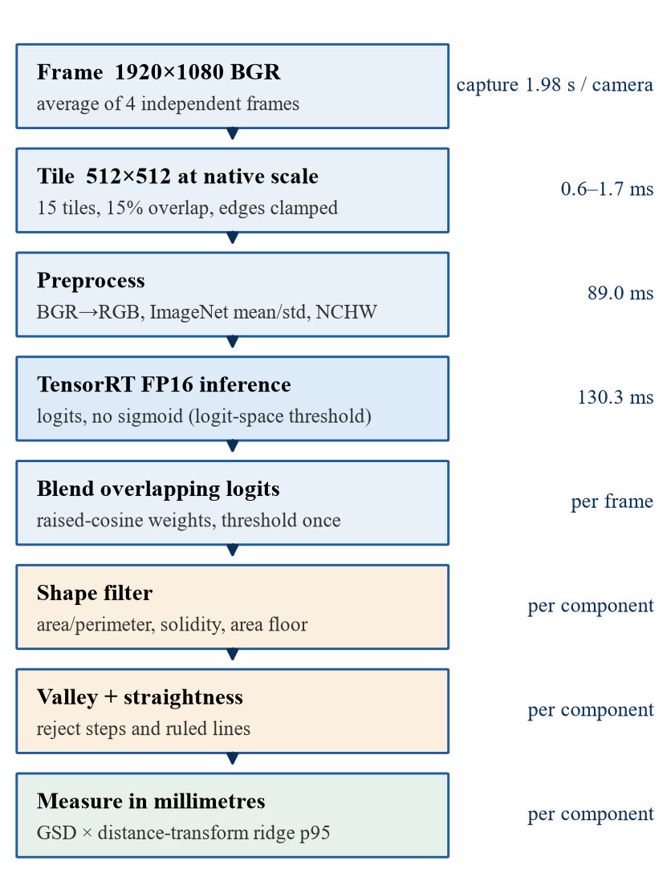

- **Shows.** The eight stages with the cost of each.
- **Source.** SCHEMATIC with MEASURED labels: capture 1.98 s/camera (Fig. 16),
  tile 0.6–1.7 ms, preprocess 89.0 ms, inference 130.3 ms (`bench_tiling.py`).
  Blend and per-component stages are labelled "per frame"/"per component" because
  their cost was not separately timed.
- **Read.** Orange stages operate per connected component.

## Fig. 11 — Console layout

- **Shows.** The inspection console's panels: header (connection, mode, scan
  count, inference time, GPU clock), the three-camera composite, per-camera strip,
  event log, and four side panels (verdict, measurements, pipeline, system).
- **Source.** SCHEMATIC from `docs/phase2/03-ui.md`. Values are **placeholders**
  (`<n>`, `<ms>`, `<width> mm`) on purpose, so no invented number looks like a
  result.
- **Note.** The red caption "DISPLAY COMPOSITE — detection is per-camera" is on
  the real page too, for the reason in [04 §1](04-camera-and-capture.md).

## Fig. 12 — Training curves

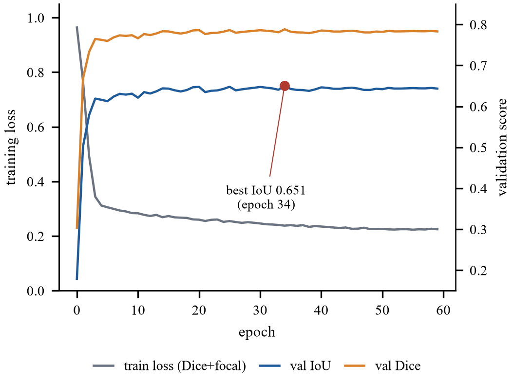

- **Source.** DATA: `crack_outputs/train_log.csv`.
- **Read, caveats.** See [03 §4](03-model-and-training.md). Best val IoU 0.6505 at
  epoch 34; last 20 epochs std 0.0016.

## Fig. 13 — Threshold sweep

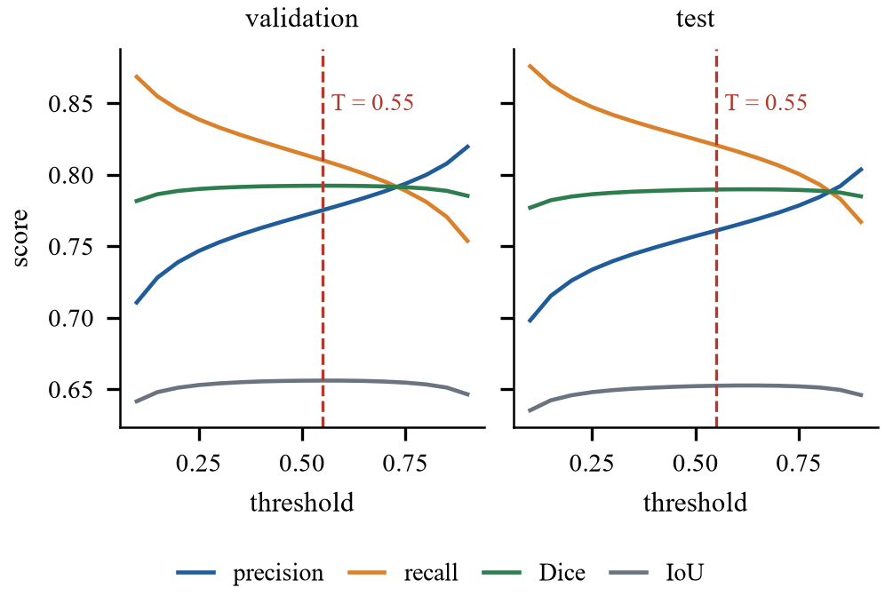

- **Source.** DATA: `val_sweep.npy`, `test_sweep.npy` (rows: threshold,
  precision, recall, Dice, IoU).
- **Read.** Dice/IoU are flat; precision rises and recall falls with threshold;
  the red line is the deployed 0.55 (the *validation* optimum).
- **See.** [03 §5](03-model-and-training.md).

## Fig. 14 — False-positive region sizes on crack-free images

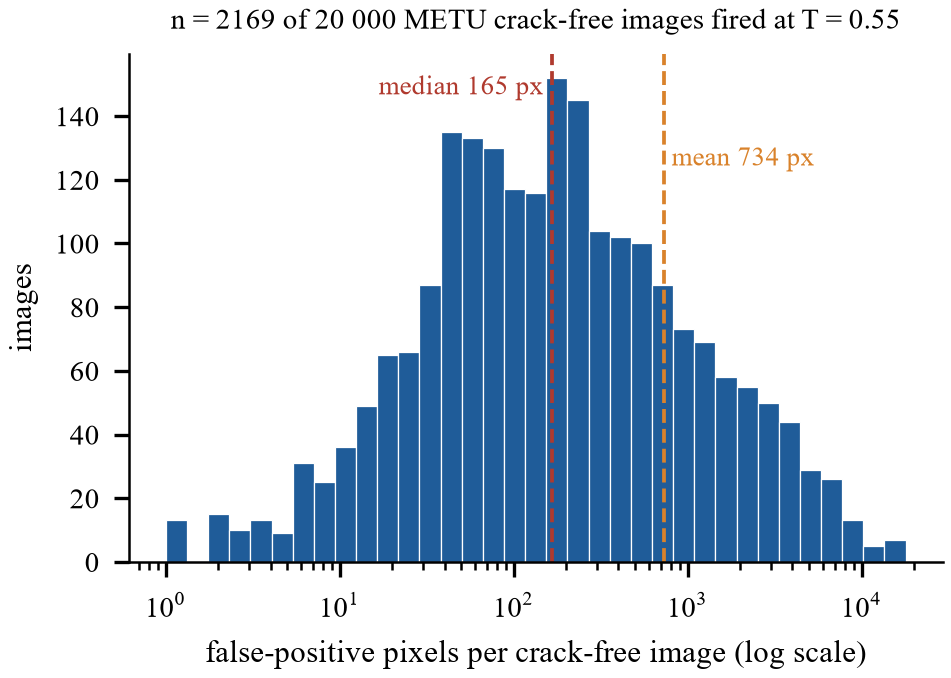

- **Source.** DATA: `metu_negative_pixels.npy` (n = 2169).
- **Read.** Log x-axis; median 165 px, mean 734 px, max 17,040 px.
- **Caveat.** These are images that *fired*; the other ~89 % of the 20,000 had
  zero false pixels and are not in the histogram.

## Fig. 15 — Latency

- **Source.** MEASURED: `bench_tiling.py` and `trtexec`.
- **See.** [06 §2](06-deployment-console-network.md).

## Fig. 16 — One scan position

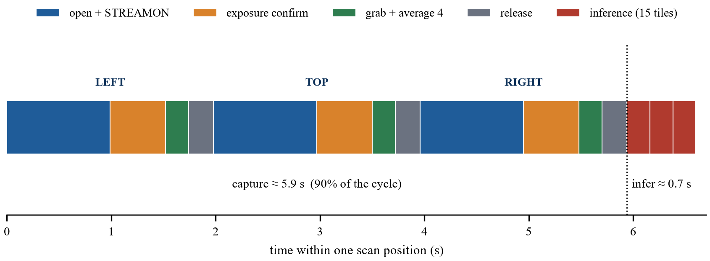

- **Source.** MEASURED, `capture.py bench`: open 0.99, confirm 0.53, grab 0.22,
  release 0.24 per camera (×3), then inference 0.22 ×3.
- **Read.** Colour = stage; the dotted line separates capture from inference.
  Capture ≈ 5.9 s = 90 % of the cycle.
- **See.** [04 §3](04-camera-and-capture.md).

## Fig. 17 — False-positive reduction

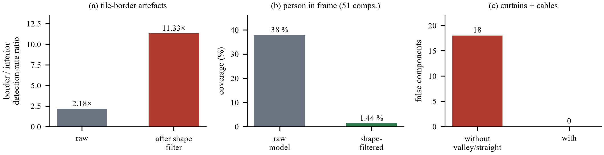

- **(a)** Border ÷ interior detection rate: **2.18×** raw, **11.33×** after the
  shape filter — MEASURED, `analyze_tile_edges.py`, 3 frames × 15 tiles.
- **(b)** Person in frame: coverage **38 % → 1.44 %** over 51 components —
  MEASURED, `analyze_blobs.py`.
- **(c)** Curtains and cables: **18 → 0** false components — MEASURED on the
  `main` vs `accuracy-filters` comparison.
- **Caveat.** Three different scenes, three different measurements, one figure.
  They are *not* one before/after sequence on the same frame.

## Fig. 18 — Valley vs step

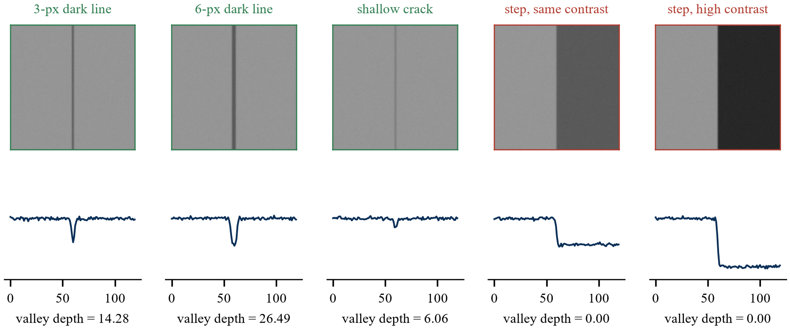

- **Source.** CODE: `verify.report` on `test_verify` synthetic images.
- **See.** [05 §7.1](05-perception-pipeline.md).

## Fig. 19 — Straightness vs wander

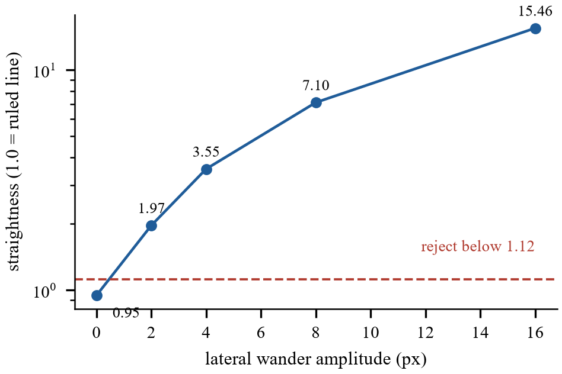

- **Source.** CODE: `verify.report` on `test_verify.wavy_mask`.
- **Read.** Log y-axis; dashed line is the 1.12 rejection threshold.
- **See.** [05 §7.2](05-perception-pipeline.md).

## Fig. 20 — Width estimators vs truth

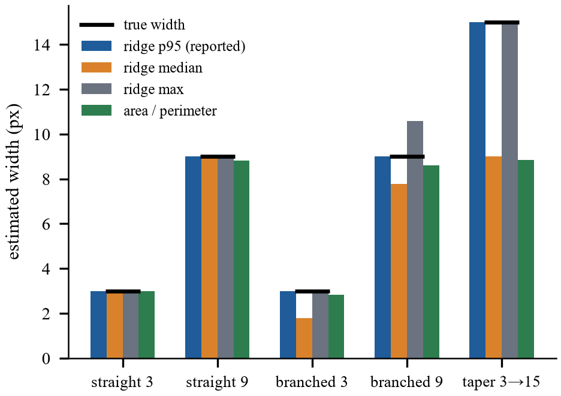

- **Source.** CODE: `measure.components` on `test_measure` shapes at GSD = 1.
- **Read.** The black dash is the true width. Orange (median) falls short on
  branched shapes; grey (max) overshoots branched-9; blue (p95, reported) tracks
  truth.
- **See.** [05 §8.3](05-perception-pipeline.md).

## Fig. 21 — Resolution vs standoff

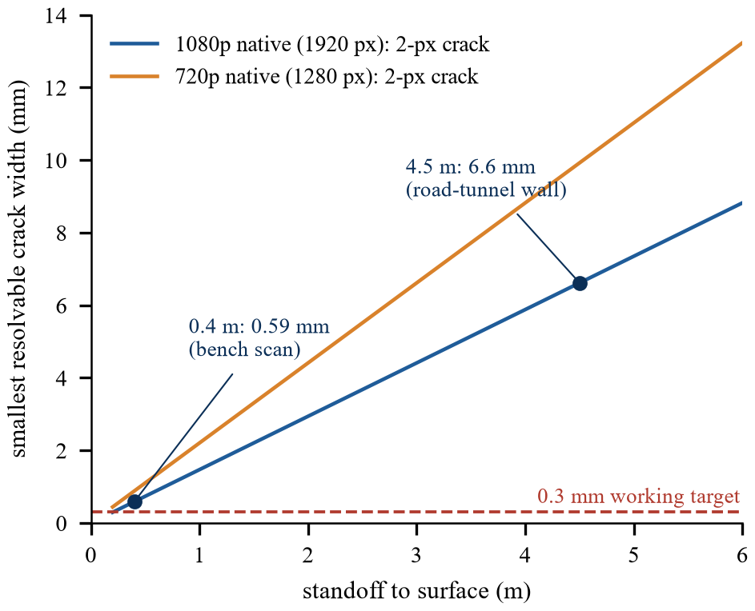

- **Source.** DERIVED from Eq. 1 with HFOV 70.42°.
- **Read.** Straight lines. At 0.4 m the 1080p camera resolves 0.59 mm; at 4.5 m
  (road-tunnel wall) 6.6 mm — 22× the 0.3 mm target.
- **See.** [05 §10](05-perception-pipeline.md).

---

# Tables

| # | Title | Source |
|---|---|---|
| I | Positioning vs prior-work classes | literature (qualitative) |
| II | Platform and software | project docs |
| III | CRACK500 accuracy at T = 0.55 | DATA |
| IV | Threshold effect (test) | DATA |
| V | Latency | MEASURED |
| VI | Capture modes | MEASURED |
| VII | Exposure controller simulation | MEASURED (sim) |
| VIII | Valley depth | CODE |
| IX | Straightness | CODE |
| X | Width estimators | CODE |
| XI | GSD vs standoff | DERIVED |
| XII | Scan vs live | MEASURED |

### Table I — Positioning against prior-work classes

Classes (image-level CNNs, lightweight edge models, LiDAR/SLAM fusion,
marker-based pose) vs output, spatial grounding, edge-deployability. **Purely
qualitative**, built from what the cited papers' titles and abstracts state; no
benchmark was run. "This work" is the only row with *width in mm per component*
and *assumed standoff* as its grounding — the latter being a weakness, stated.

### Table II — Platform and software

Jetson Orin Nano 8 GB, MAXN_SUPER, 1020 MHz; JetPack 6.2.3, TensorRT 10.3.0,
CUDA 12.6, OpenCV 4.8.0; 3 × C920 (046d:08e5); HFOV 70.42°; one USB 2.0 hub;
FP16 deployed. Source: `docs/WORKLOG-2026-09-16.md` §2–3.

### Table III — CRACK500 accuracy at the deployed threshold

| Split | Crops | P | R | Dice | IoU |
|---|---|---|---|---|---|
| Train | 2333 | — | — | — | — |
| Val | 526 | 0.775 | 0.810 | 0.792 | 0.656 |
| Test | 509 | 0.761 | 0.821 | 0.790 | 0.652 |

DATA: column of the sweep arrays at T = 0.55. Train row is "—" because training
metrics were not recorded per split. The note under the table says sweep IoU
differs slightly from the per-epoch log.

### Table IV — Threshold effect on the test split

DATA, columns for T ∈ {0.30, 0.45, 0.55, 0.70, 0.90}. Shows IoU ranging only
0.646–0.652 — the threshold is a precision/recall choice, not an accuracy one.

### Table V — Measured inference and per-camera latency

MEASURED. FP16 8.77 ms / FP32 18.44 ms / parity 0.0552 % / 720p 88.2 ms / 1080p
221.1 ms / live ≈ 15 ms.

### Table VI — Simultaneous capture by mode

| Mode | Cameras streaming | Rate |
|---|---|---|
| 640×480 MJPG 15 | 3 of 3 | 15.0 fps |
| 1280×720 MJPG 30 | 2 of 3 | 15.2 fps |
| 1920×1080 sequential | 3 of 3 (one at a time) | n/a |

MEASURED, `multicam_probe.py`. The third row is the design outcome, not a probe
result.

### Table VII — Exposure controller on a simulated sensor

Seven scenarios, all pass; MEASURED in simulation (`test_ae_sim.py`). Note the
caveat in [04 §6](04-camera-and-capture.md): this is the *first* control law,
before the ladder was found.

### Tables VIII & IX — Valley depth and straightness

REPRODUCED from `test_verify.py`; see [05 §7](05-perception-pipeline.md).

### Table X — Width estimators on shapes of known width

Five of the thirteen cases (straight 3/9, branched 3/9, taper 3→15), REPRODUCED
from `test_measure.py`; the full thirteen are in [05 §8.3](05-perception-pipeline.md).

### Table XI — Ground sample distance and resolvable width

DERIVED, every cell recomputed from Eq. 1 (two cells' rounding was corrected
while writing this documentation: 0.25 m → 0.37 mm, 1.00 m → 0.74 mm/px).

### Table XII — Scan against live preview

MEASURED. See [04 §9](04-camera-and-capture.md) and
[06 §4](06-deployment-console-network.md).

---

# Equations

| Eq. | Formula | Where it appears in code | Explained |
|---|---|---|---|
| 1 | GSD = 2·d·tan(HFOV/2)/W | `measure.gsd_mm_px` | [02 §5](02-theory-primer.md) |
| 2 | ℓ = ln(t/(1−t)) | `trt_infer.logit` | [02 §1](02-theory-primer.md) |
| 3 | L(x) = Σwᵢℓᵢ / Σwᵢ | `tiler.blend_logits` | [02 §10](02-theory-primer.md) |
| 4 | V(p) = min(I(p+dn), I(p−dn)) − I(p) | `verify.valleyness` | [02 §13](02-theory-primer.md) |
| 5 | w = 2dᵣ − 1 | `measure._width_from_distance` | [02 §12](02-theory-primer.md) |
